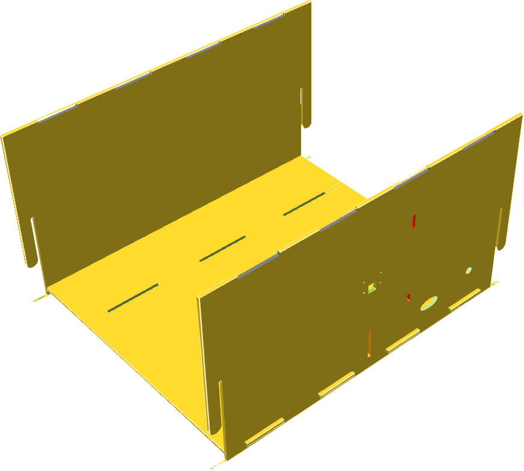
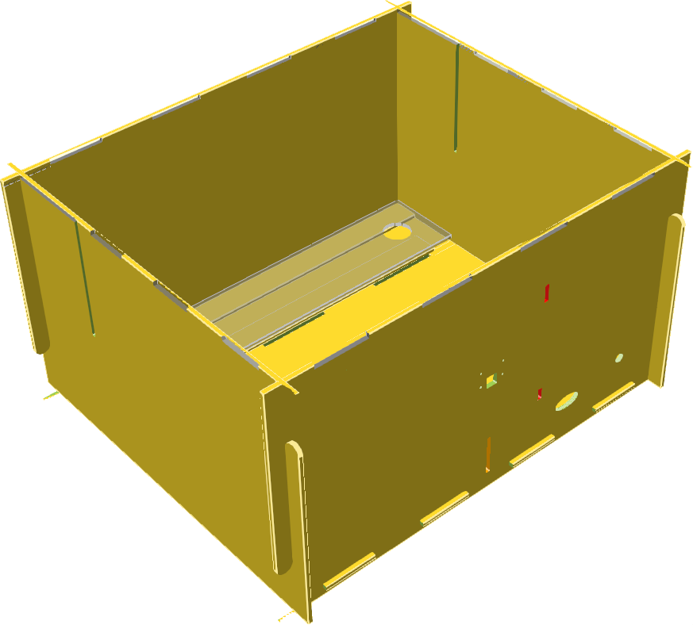
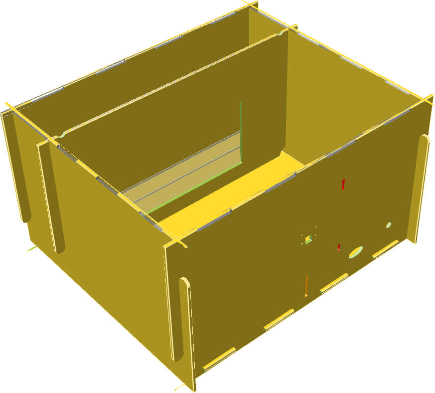
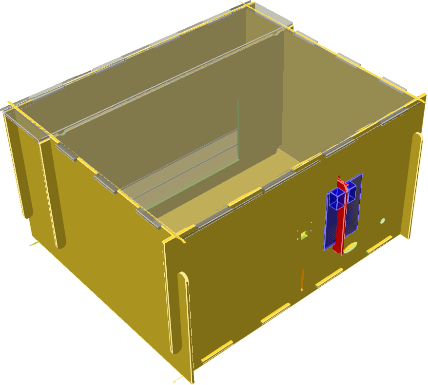
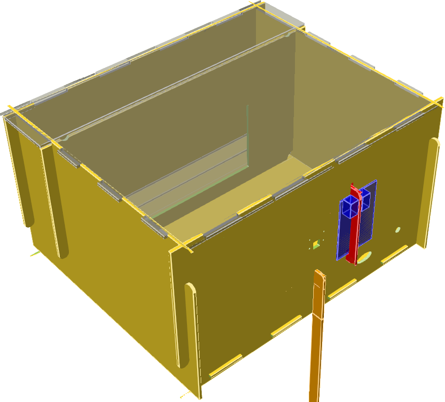
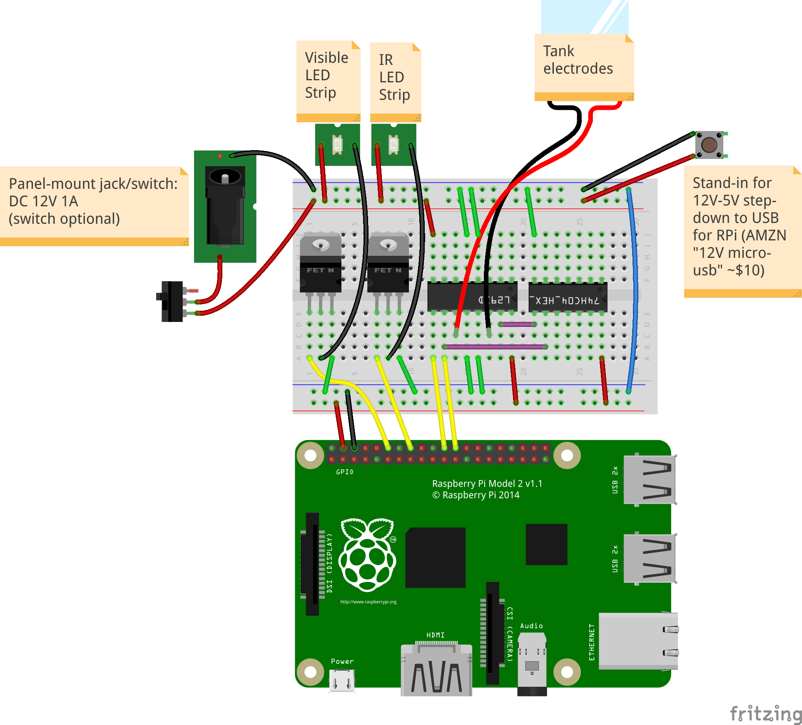

# Building an ATLeS Box Enclosure

The `designs` folder in the ATLeS repository contains source files for nearly all of the parts required to build an ATLeS box enclosure.  In the `designs/box/box_structure.scad` is an [OpenSCAD](http://www.openscad.org/) 3D model of the enclosure.

DXF files suitable for laser-cutting are provided in `designs/dist`.  They can be re-created from the OpenSCAD source using `make` (requires OpenSCAD).

The enclosure was designed to be laser cut from 1/8" [hardboard](https://en.wikipedia.org/wiki/Hardboard).  Other sheet materials suitable for laser cutting (e.g. plywood or acrylic) may work with small modifications to the design to account for different material thickness.

## Build Walkthrough

All of the DXF files in `designs/dist` should be laser cut out of opaque material *except* `tank_support.dxf`, which is meant to be clear acrylic (so the infrared illumination below it reaches the tank above).  The `tank_baffle*.dxf` and `tank_lid*.dxf` files are not part of the enclosure, but rather they are designed to be used in a particular model of fish tank.

### Step 1
To start, slot the bottom sheet `bottom.dxf` into the slots on the two end pieces `end1.dxf` and `end2.dxf`:

{:.center}
[{:width="500px"}](imgs/box_structure_1.png) 
Build step 1

### Step 2
Next, slide the two side pieces `side1.dxf` and `side2.dxf` into the slots on the edges of the end pieces to form a box:

{:.center}
[{:width="500px"}](imgs/box_structure_2.png) 
Build step 2

The above image also shows the placement of the clear acrylic tank support pieces.  The two thin pieces are on the bottom, with room between for the strip of infrared lights, and the larger piece covers them and provides a platform for the fish tank.

### Step 3
The mask piece `mask.dxf` slides in from the top, interfacing with the two sides:

{:.center}
[{:width="500px"}](imgs/box_structure_3.png) 
Build step 3

### Step 4
The two top pieces `top.dxf` fit into place on top of the box (they are translucent here but should be opaque in reality), and the support bracket for the Raspberry Pi holds it in place as shown:

{:.center}
[{:width="500px"}](imgs/box_structure_4.png) 
Build step 4

The camera mounts using M2 standoffs and screws.  The circular hole in the back piece is for mounting a 2.5mm DC jack for power, and the wider, elliptical hole is for passing wires through from the Raspberry Pi to the electronics inside.

### Step 5 (only if stacking)
Enclosures can be stacked up to three high, with each offset to the rear from the one below to allow access to load fish tanks into each.  In this case, a rear support piece can be added at the vertical slit on the rear of any box whose back is now unsupported:

{:.center}
[{:width="500px"}](imgs/box_structure_5.png) 
Build step 5 (optional)

Adjust the length of the support piece as needed to reach the surface below.

# Electronics

The electronics require some wiring.  Knowledge and experience with electronics is helpful.

{:.center}
[{:width="500px"}](imgs/box_circuit_bb.png) 
The main breadboard

The above image shows the connections that need to be made.  The source file, made with [Fritzing](http://fritzing.org/), is available in `designs/circuit/box_circuit.fzz`.

Our [bill-of-materials spreadsheet](https://docs.google.com/spreadsheets/d/1JdE_qXsXnkHEHv3YeQ8cLeGDJKUJM5uZkHw2dTtAtYg/edit?usp=sharing) lists the required parts along with estimated costs and links to options for purchasing most of them.

Everything should be powered from a 12VDC supply that can provide at least 1A of current.  Via a jack, wire the 12VDC to the top blue and red rails of the breadboard as shown.  **NOTE** that only the ground (blue) rail is shared with the bottom; the bottom red rail is 5VDC provided by the Raspberry Pi.

The Pi is powered with 5VDC over a micro-USB connection.  Many 12V to 5V micro-USB converters are available on Amazon (the bill of materials contains a link to one).

A strip of white, visible-light LEDs should be installed along the top of the back wall of the enclosure (where the camera is mounted), and a strip of infrared LEDs should be mounted on the bottom of the enclosure below where the fish tanks will be placed.  The positive/power lead of each strip is connected to the +12VDC rail, while the negative/ground for each connects to an N-type power MOSFET on the breadboard so it can be controlled by the Pi.  The other pins of each MOSFET are connected to ground and to a specific GPIO pin on the Pi (the software has those pin numbers hard-coded).

If using electrical stimulus in the fish tanks, suitable electrodes (large pieces of ideally non-reactive metal) should be placed at each end of the tank and each wired back to the breadboard.  In our current design, they are driven by an L293D dual H-bridge motor controller.  We use a standard 7400-series hex inverter chip alongside that.
