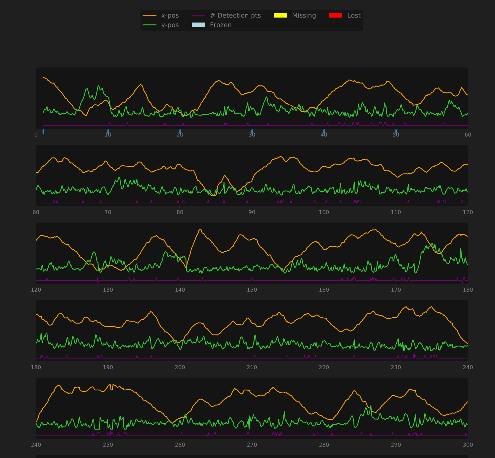
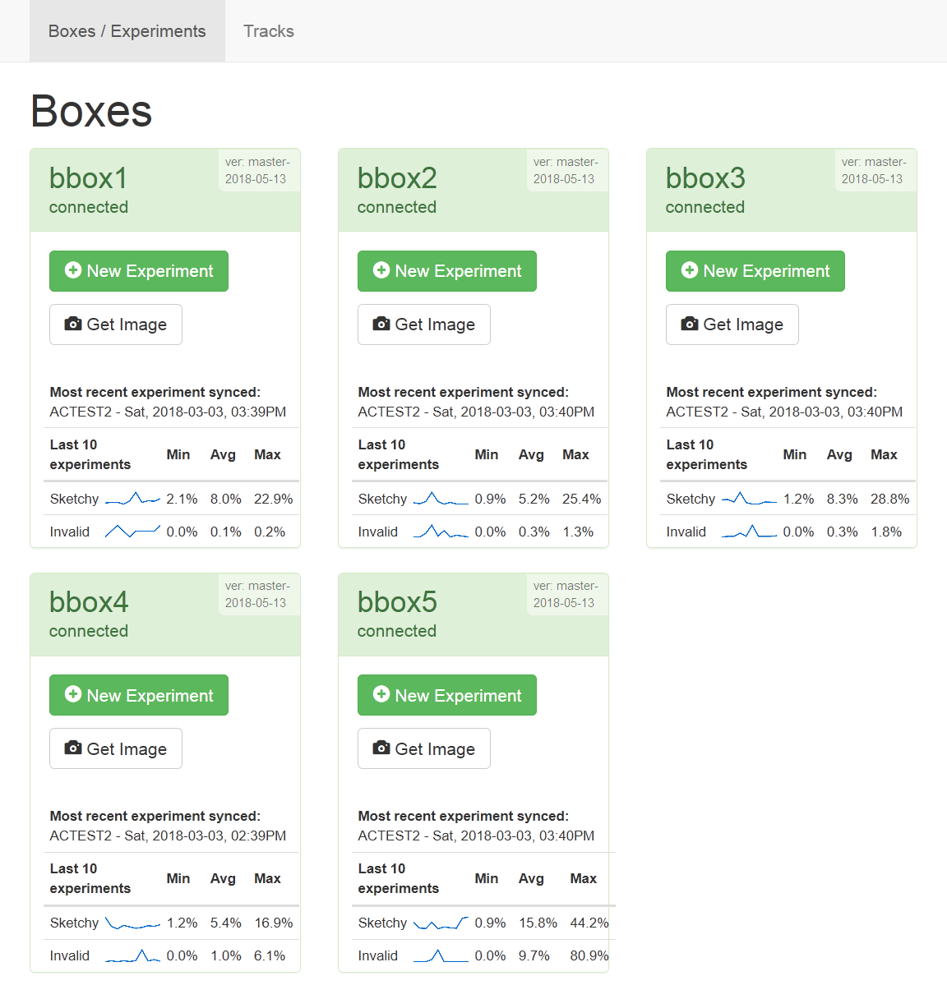

The goal of the ATLeS project is to create an inexpensive, open-source system for automated, high-throughput, realtime observation and conditioning experiments.  Zebrafish, *danio rerio*, are the target organism for the initial design.

{:.center}
[{:width="200px"}](imgs/web_interface_plots_1.png)
[{:width="200px"}](imgs/web_interface_plots_2.png)

ATLeS consists of one or more ATLeS boxes, each of which can run an automated experiment on a single organism at a time, and a separate server that provides a combined interface for managing and controlling all of the boxes and their experiments in one place.
Each box uses an inexpensive [Raspberry Pi](https://www.raspberrypi.org/) as its "brain," an infrared-sensitive camera as its "eyes," and inexpensive materials for the structure.
A central server can connect to boxes over a network (ethernet or wifi) to control and manage them via a web interface.
The server software is written in Python, and it runs under Linux, OS X, or Windows.

# Make Your Own

All source files, including code and complete designs for physical parts, are available in the [ATLeS Github repository](https://www.github.com/liffiton/ATLeS).

Building a single ATLeS box costs roughly $100 and requires some assembly and wiring.  The enclosure is designed to be laser cut from hardboard or similar flat, rigid materials.  Using the provided design files, you can either laser-cut the pieces yourself or order them from an online laser-cutting service.

{:.center}
[{:width="300px"}](imgs/box_structure_complete.png)

The following pages walk you through the assembly and software installation:

 * [Building an ATLeS Box Enclosure](building)
 * [System Integration & Setup](setup)

# Use It

After the boxes are assembled and the software is installed, run ``src/atles_web.py`` and point a browser to ``http://[hostname]:8080/``.  As you turn on boxes, they should become visible in the main web interface.

{:.center}
[{:width="300px"}](imgs/web_interface_boxes.png)

The web interface displays the status of every connected box, provides an interface for launching and monitoring experiments, and includes a full set of analysis and visualization tools for collected data.

The following page provides more details:

 * [Using ATLeS](usage)

# Adapt It

Because the entire system is open-source, from the code to the physical design, you can modify and adapt the system to suit your needs.  Modify the enclosure to accomodate a different style of tank.  Tweak the software to perform a different analysis.  Or just take a component out to use in your own system.  See [Licenses](licenses) for details.

The following pages provide information for anyone interested in modifying or working on the software:

 * [(Manual) box software installation](box_sw_manual_install)
 * [Box software image cloning](box_sw_cloning)
 * [Box software usage notes](box_sw_notes)
