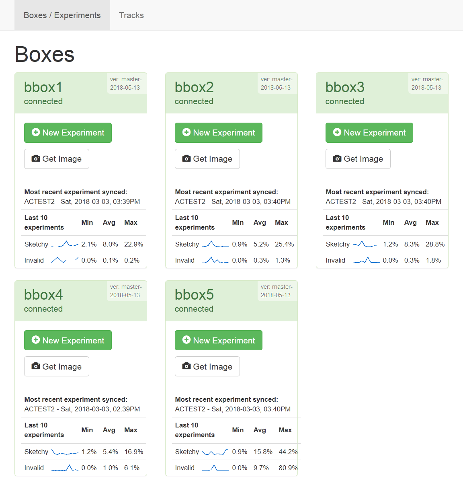
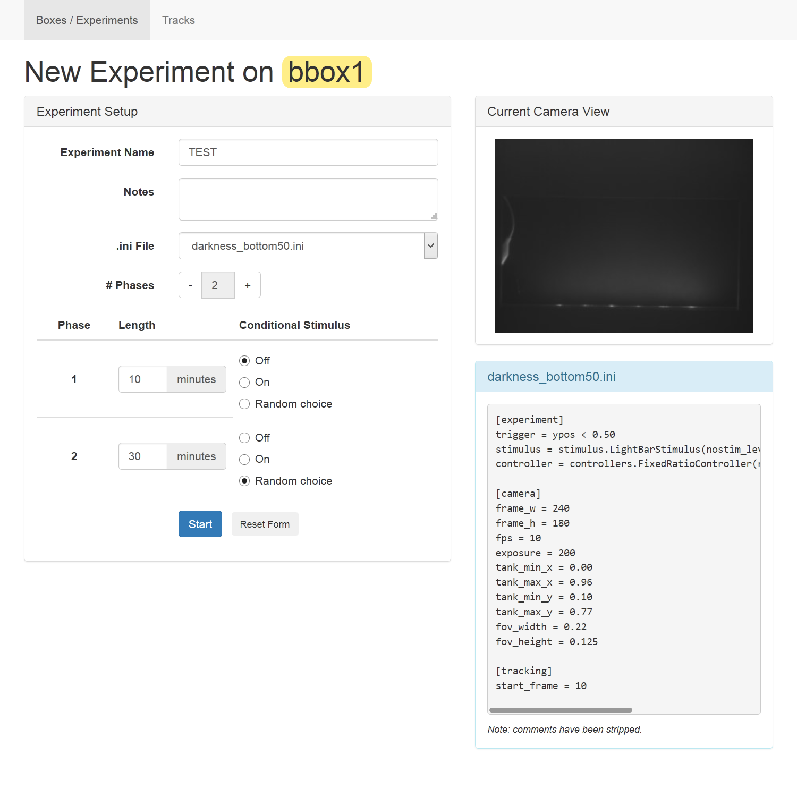
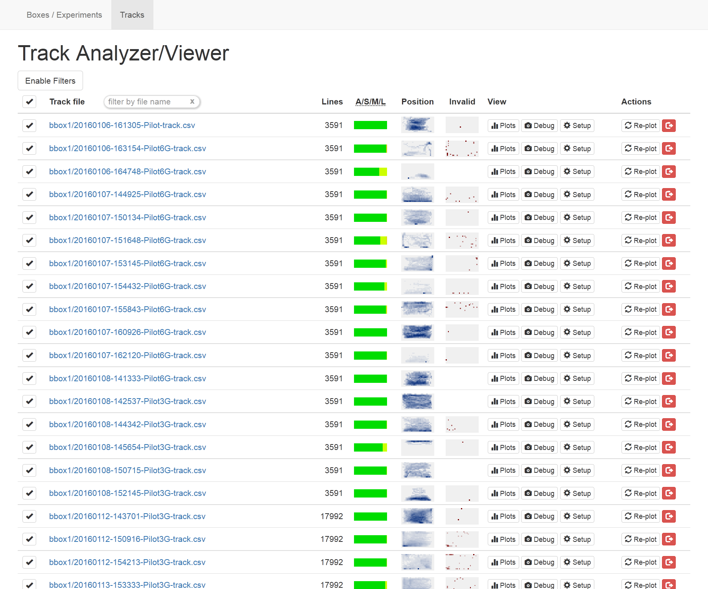
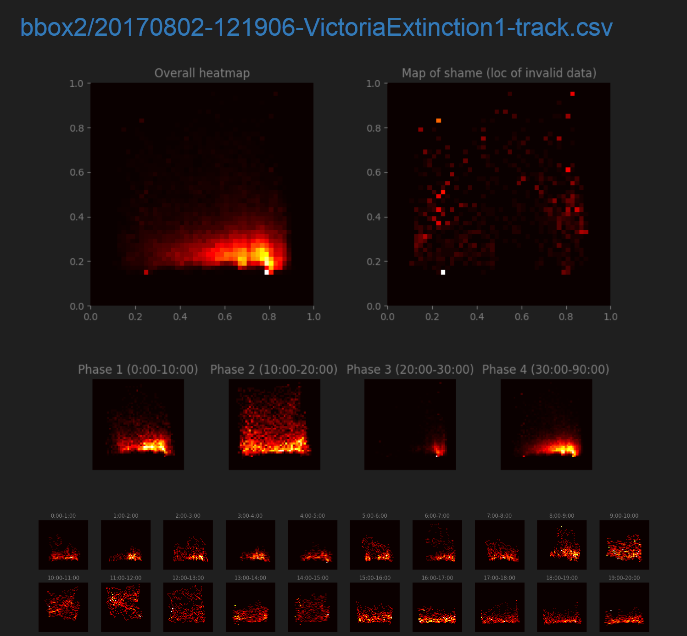
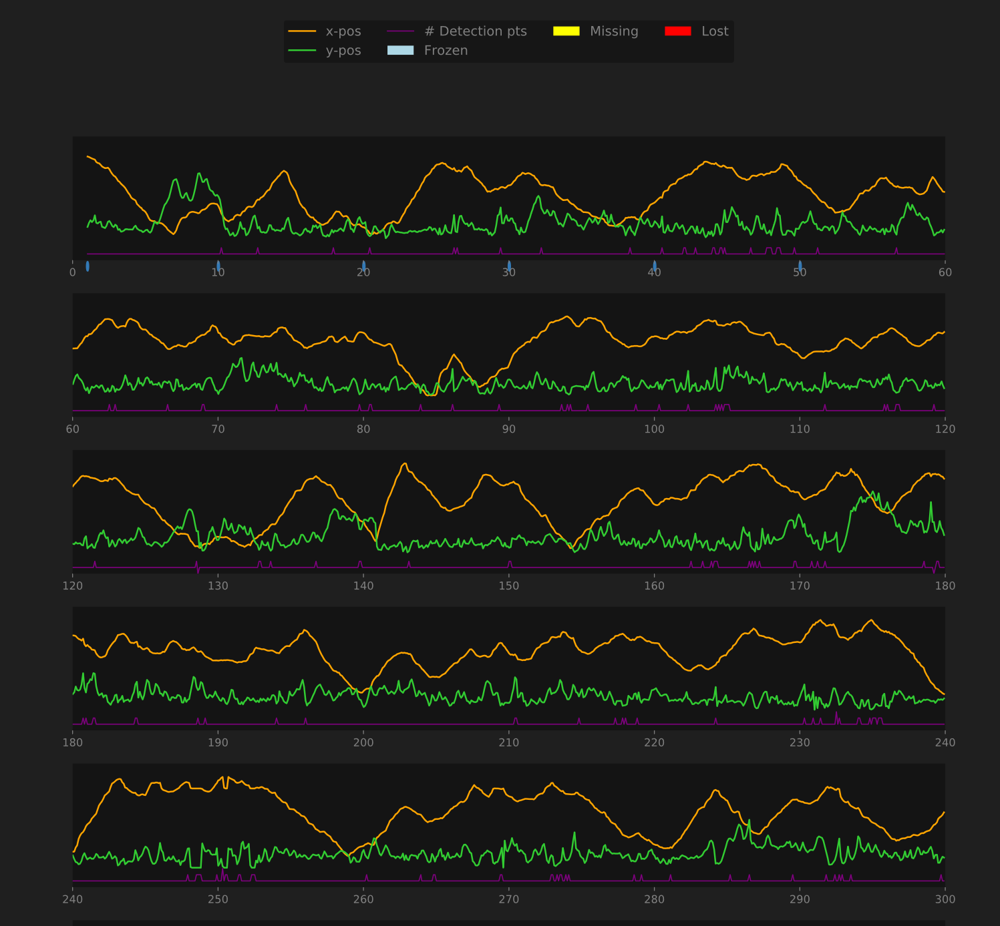

With the ATLeS server running (``src/atles_web.py``), point a browser to ``http://[hostname]:8080/`` to access the web interface.

# Main Interface

The main page will show all of the boxes that are or have been connected:

{:.center}
[{:width="500px"}](imgs/web_interface_boxes.png)

Each box shows:
 * Its name, current status, and the version of the software it is running.
 * Simple statistics on the tracking quality from the last ten trials that box ran.
 * A button for launching a new experiment/trial.
 * A button to see the current view of that box's fishtank through the camera.

# New Experiment Interface

Pressing any "New Experiment" button brings up the following interface for the given box:

{:.center}
[{:width="500px"}](imgs/web_interface_new_experiment.png)

The box in the top right shows a live view from the box's camera.  Use this to verify that a tank and fish are present and that the lighting is appropriate (fully illuminated with no bright spots from glare or reflections).

The details of the experiment to be run are specified on the left.  You can set:
 * The experiment name.  Use the same name across a set of similar experiments for easy grouping and analysis later.
 * Notes on this particular run.  You can use this to differentiate experimental conditions controlled outside of the software such as information about the fish or a drug added to its water.
 * The .ini file -- used to configure the tracking and the experimental stimulus applied.  (See [.ini Files](#inifiles) below.)
 * The phases of the experiment, with a length (in minutes) and whether the stimulus will be on or off for that phase.  "Random choice" means that the system will randomly decide whether the stimulus is active during that phase, with equal probability for on and off.

## .ini Files

The .ini files specify details of an experiment that are constant from trial to trial.  They are saved in the `ini` folder.  The examples included in the repository contain comments explaining what can be set in an .ini file.  Create a new file by copying and modifying one of the examples to suit your setup.

**NOTE:** Currently .ini files must be present both on the server and on all of the box Raspberry Pis.  To manually copy an .ini file to a Pi, use `scp`:

    $ scp file.ini pi@boxhostname:ATLeS/ini/

## Running an experiment

Upon starting an experiment, the main interface will show the status of the experiment including the time remaining.  When an experiment ends, the recorded data will be automatically synced from the Pi to the server.

# Tracks Interface (Collected Data)

The "Tracks" link at the top of the page takes you to a page that lets you view and analyze collected data.

{:.center}
[{:width="500px"}](imgs/web_interface_tracks.png)

All collected tracks are shown by default.  Press "Enable Filters" to filter the shown tracks by attributes like experiment name, length, tracking quality, etc.  A quick filter based on the filenames is also available in the table header.

Each row of the table contains:
 * The name of the track file with a link to its raw data.
 * The number of lines in the file (as a quick indicator of the length of that track).
 * An "A/S/M/L" chart showing what percentag of the points in the track have the status "Acquired", "Sketchy", "Missing", or "Lost".  "Sketchy" points are those in which the tracking identified more than one point and chose the best one (nearest to the last known position of the fish).  "Missing" and "Lost" are both for times at which no fish was found; the status will first become "Missing" and then "Lost" after 5 tracking frames with no fish found.
 * A "position" heatmap showing where in the tank the fish was over the course of the entire experiment.
 * An "invalid" heatmap showing where in the tank the fish was before it was ever missing or lost; this can help identify common locations where tracking fails, if any.
 * Buttons to view plots, debug frames, and setup files (described below).
 * Buttons to re-create the plots for a track and to archive it (hide it from this view, though the file is retained on the system).

Some or all of the displayed tracks can be selected using the checkmarks in the leftmost column, and actions to be taken on the selected tracks (described below) are available at the bottom of the page.

## Plots

The ATLeS software can generate plots visualizing the data in a track.

{:.center}
[{:width="500px"}](imgs/web_interface_plots_1.png)

First are a variety of position heatmaps.  The "Overall heatmap" shows where the fish was over the entire track, and the "Map of shame" shows locations where tracking failed.  Position heatmaps for each phase and for each minute of the experiment follow.

{:.center}
[{:width="500px"}](imgs/web_interface_plots_2.png)

Plots visualizing the time series data show:
 * The location of the fish over time (as separate plots of its X- and Y- coordinate at each time)
 * The number of points detected at each time (1 is good, 2 or more is "sketchy", and 0 is "missing" or "lost")
 * When the tracking status was "missing" or "lost", indicated by yellow and red bars along the bottom of the plot
 * Whether the fish was "frozen" at any point, indicated by a blue bar along the bottom of the plot

Additionally, small blue dots are placed along the x-axis of the plot.  Each indicates a time at which a debug frame was recorded.  Mouse over the dot to view the frame captured at that time.

## Debug Frames

For debugging purposes, ATLeS records the current frame (whatever it's seeing through the camera) at a regular interval as well as whenever it first loses tracking (entering the "missing" state).  These can be viewed individually in the Plots view as described above or viewed all together on one page by choosing the "Debug" button for any track.

The first frame is shown with the entire view of the camera, and "subframes," the cropped and grayscale images used in the actual tracking, are shown for later frames.  Press "+" to increase the brightness of all displayed frames; this helps make out faint features.

## Setup Files

Each setup file contains all of the details of how that experiment for that track was run.  This includes all of the information from the chosen .ini file for that track plus anything set in the "New Experiment" interface.  This file can provide metadata to be used in analyses of track files.  For example, it allows you to differentiate between trials where the "Random" stimulus was chosen to be active and those where it was not.

## Selection Actions

When one or more track files are selected using the checkboxes in the main Tracks view, the actions at the bottom will become available:

### Filter

Filter the view so that only the selected tracks remain.

### Generate aggregate heatmaps

Generates heatmaps for each phase of an experiment over all selected tracks.  That is, one heatmap will be generated for the first phase of the experiment showing the locations of all of the fish in all of the selected tracks, one for the second phase, etc.  This requires that all selected tracks share the same phase lengths.

### Download raw data [.zip]

Download a .zip archive containing all of the selected tracks and their setup files.

### Re-plot

Regenerate the plots for all selected tracks (or generate them for the first time if they haven't been created yet).

### Archive

Archive all of the selected tracks (hides them, but the files still remain in the `data` directory under `data/tracks_archive`).

### Statistics

These actions calculate a large number of statistics for the selected tracks and produce a table with one row per track and one column per calculated statistic.  They can be viewed in the browser or downloaded as a .csv file.  The "(extinction)" variants produce calculations specific to a learning/extinction experiment.

# Further Analysis

A Jupyter notebook demonstrating deeper analysis of track data can be found in the `notebooks` directory.  View it on Github [here](https://github.com/liffiton/ATLeS/tree/master/notebooks), including a link to run a live, editable version of the notebook with some of our experimental data.
